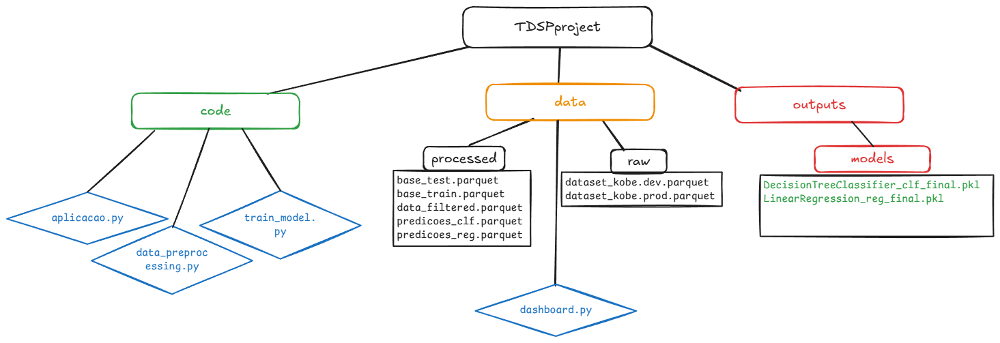
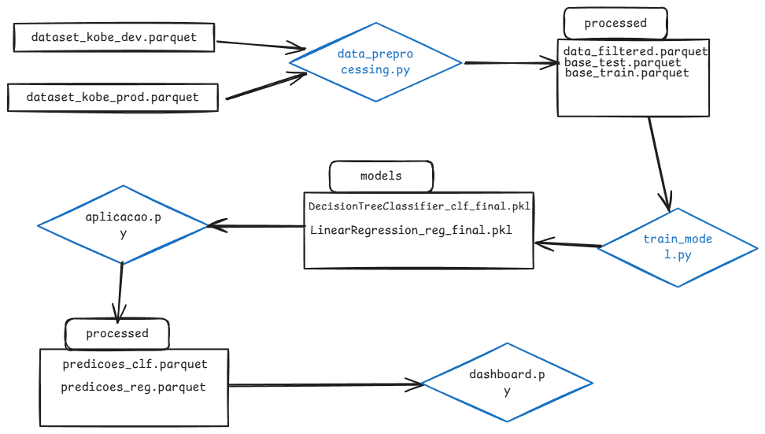

# 🏀 Projeto: Preditor de Arremessos - Kobe Bryant
## Estrutura do projeto

## Flowchart

## 🔁 Diagrama do Pipeline (Descrição Textual)

O pipeline do projeto é composto por:

1. **Aquisição e Preparação de Dados**
   - Leitura dos dados de desenvolvimento e produção.
   - Remoção de dados faltantes.
   - Seleção de colunas relevantes.
   - Armazenamento do dataset limpo.

2. **Divisão de Dados**
   - Separação estratificada entre treino (80%) e teste (20%).
   - Registro dos tamanhos das bases no MLflow.

3. **Treinamento de Modelos**
   - Utilização do PyCaret para configuração e treino.
   - Avaliação com métricas como log loss e F1-score.
   - Escolha do melhor modelo.

4. **Aplicação do Modelo**
   - Carregamento da base de produção.
   - Aplicação do modelo salvo para gerar predições.
   - Registro das métricas de produção.

5. **Monitoramento**
   - Dashboard interativo em Streamlit.
   - Análise contínua da performance do modelo.

---

## 🧰 Ferramentas e Suas Funcionalidades

### **MLflow**
- **Rastreamento de Experimentos:** Registro de parâmetros, métricas, artefatos.
- **Monitoramento:** Métricas de produção armazenadas e comparadas.
- **Atualização e Deployment:** Versionamento e publicação de modelos.

### **PyCaret**
- **Funções de Treinamento:** Automação do setup, comparação e tuning.
- **Simplicidade:** Torna o processo acessível mesmo para não especialistas.

### **Scikit-Learn**
- **Modelos Base:** Utilizado internamente pelo PyCaret.
- **Flexibilidade:** Permite personalização e inspeção detalhada.

### **Streamlit**
- **Dashboard Interativo:** Visualização fácil e dinâmica das métricas.
- **Acompanhamento Contínuo:** Ideal para uso por áreas técnicas e de negócio.

---

## 📦 Artefatos Criados

| Artefato | Descrição |
|---------|-----------|
| `data_filtered.parquet` | Dataset limpo após remoção de nulos e seleção de colunas. |
| `base_train.parquet` e `base_test.parquet` | Dados separados com estratificação. |
| Modelos treinados (`.pkl`) | Arquivos dos modelos para produção. |
| `predicoes_clf.parquet` | Resultados das predições com base de produção. |
| MLflow Tracking | Histórico de runs, parâmetros, métricas e artefatos. |
| Dashboard Streamlit | Interface gráfica de monitoramento. |

---

## 🎯 Impacto da Divisão Treino/Teste e Estratégias Contra Viés

- A separação correta permite avaliar a capacidade de generalização do modelo.
- Evita overfitting.
- Simula cenários reais de produção.

**Estratégias para reduzir viés:**
- Divisão estratificada.
- Balanceamento de classes.
- Engenharia de atributos.
- Validação cruzada.

---

## ✅ Escolha do Modelo Final e Justificativa

- **Critérios de escolha:** Melhor desempenho em log loss e F1-score.
- **Regressão Linear:** Apesar de simples, foi utilizada para fins comparativos e demonstrativos no contexto da variável contínua simulada.
- **Árvore de Decisão:** Capta interações não-lineares, é mais robusta com variáveis categóricas e obteve melhor desempenho na tarefa de classificação.

A Árvore de Decisão foi escolhida como modelo final por apresentar melhores métricas de desempenho e maior robustez para o problema em questão.

---

## 🔄 Diferença entre Base de Treino e Produção

A base de produção pode apresentar diferenças significativas em relação à base de treino, o que pode impactar negativamente a performance do modelo. Essas diferenças podem ocorrer por diversos fatores, como:

- **Mudanças na distribuição dos dados:** As características das entradas podem mudar com o tempo. Por exemplo, a distância dos arremessos ou o tempo restante no jogo podem ter padrões diferentes em novos jogos. Esse fenômeno é conhecido como **data drift**.

- **Novos comportamentos ou padrões de uso:** A forma como o jogador toma decisões (como arremessar de diferentes posições ou em situações específicas) pode evoluir ao longo do tempo. Isso pode fazer com que o modelo, treinado em dados antigos, não consiga capturar essas novas nuances.

- **Diferença na completude ou qualidade dos dados:** A base de produção pode ter mais dados faltantes, erros de coleta ou até mesmo novas variáveis que não estavam presentes na base de treino. Isso compromete a consistência do pipeline.

### 🧠 Impacto

Essas variações podem resultar em:
- **Queda na acurácia e confiabilidade das predições**;
- **Dificuldade do modelo em generalizar para situações novas**;
- **Necessidade de realizar retreinamentos periódicos**, reavaliando a performance com dados mais recentes para manter a qualidade do serviço.

Manter um processo de monitoramento contínuo é fundamental para identificar essas alterações e garantir que o modelo continue entregando valor em ambiente real.

---

## 👀 Monitoramento com e sem Variável Resposta

### Com variável resposta:
- Permite cálculo direto de log loss, F1, accuracy etc.
- Ajuda a tomar decisões mais assertivas sobre o modelo.

### Sem variável resposta:
- Acompanhamento de distribuições.
- Detecção de drift.
- Análise de métricas indiretas (tempo, volume, frequência de predições).

---

## 🔁 Estratégias de Retreinamento

### **Reativo**
- É acionado após degradação de métricas em produção.
- Baseado em alertas no monitoramento.

### **Preditivo**
- Antecipado por detecção de drift nos dados.
- Executado de forma periódica ou por volume de dados acumulado.
